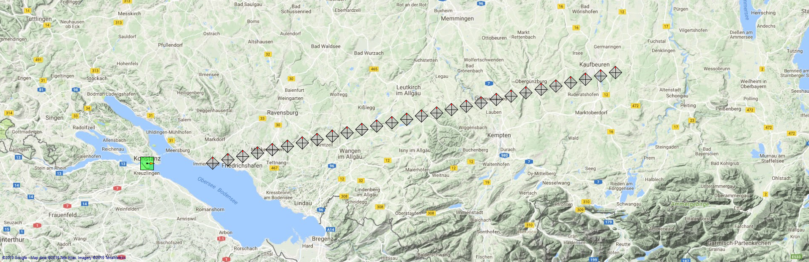

# Scenario LongLineForSimulationPlayer

## About This Scenario

|Property|Value|
|--------|-----|
|Version||
|Application Context||
|Contact Person||

---

## RFDevice List

|  Id|DeviceSource|StartTime|Name|Latitude|Longitude|Altitude|Roll|Pitch|Yaw|RxTxType|AntennaType|CenterFrequency|Bandwidth|Gain|SignalToNoiseRatio|
|---:|:-----------|:-------:|:---|-------:|--------:|-------:|---:|----:|--:|:-------|:----------|--------------:|--------:|---:|-----------------:|
|-42|User|0|RFDevice|47,6661|9,1726|0 m|0|0|0|IdealSDR|OmniDirectional|90,00 MHz|30,00 KHz|0,00 dB|0,00 dB|
|42|User|0|RFDevice|47,6666|9,3869|0 m|0|0|0|FMBroadcast|HyperLOG60200|90,00 MHz|30,00 KHz|0,00 dB|0,00 dB|
|42|Automatic|20|RFDevice|47,6739|9,4354|0 m|0|0|0|FMBroadcast|HyperLOG60200|90,00 MHz|30,00 KHz|0,00 dB|0,00 dB|
|42|Automatic|40|RFDevice|47,6812|9,4838|0 m|0|0|0|FMBroadcast|HyperLOG60200|90,00 MHz|30,00 KHz|0,00 dB|0,00 dB|
|42|Automatic|60|RFDevice|47,6886|9,5323|0 m|0|0|0|FMBroadcast|HyperLOG60200|90,00 MHz|30,00 KHz|0,00 dB|0,00 dB|
|42|Automatic|80|RFDevice|47,6959|9,5808|0 m|0|0|0|FMBroadcast|HyperLOG60200|90,00 MHz|30,00 KHz|0,00 dB|0,00 dB|
|42|Automatic|100|RFDevice|47,7033|9,6292|0 m|0|0|0|FMBroadcast|HyperLOG60200|90,00 MHz|30,00 KHz|0,00 dB|0,00 dB|
|42|Automatic|120|RFDevice|47,7106|9,6777|0 m|0|0|0|FMBroadcast|HyperLOG60200|90,00 MHz|30,00 KHz|0,00 dB|0,00 dB|
|42|Automatic|140|RFDevice|47,7179|9,7261|0 m|0|0|0|FMBroadcast|HyperLOG60200|90,00 MHz|30,00 KHz|0,00 dB|0,00 dB|
|42|Automatic|160|RFDevice|47,7253|9,7746|0 m|0|0|0|FMBroadcast|HyperLOG60200|90,00 MHz|30,00 KHz|0,00 dB|0,00 dB|
|42|Automatic|180|RFDevice|47,7326|9,8230|0 m|0|0|0|FMBroadcast|HyperLOG60200|90,00 MHz|30,00 KHz|0,00 dB|0,00 dB|
|42|Automatic|200|RFDevice|47,7400|9,8715|0 m|0|0|0|FMBroadcast|HyperLOG60200|90,00 MHz|30,00 KHz|0,00 dB|0,00 dB|
|42|Automatic|220|RFDevice|47,7473|9,9199|0 m|0|0|0|FMBroadcast|HyperLOG60200|90,00 MHz|30,00 KHz|0,00 dB|0,00 dB|
|42|Automatic|240|RFDevice|47,7547|9,9684|0 m|0|0|0|FMBroadcast|HyperLOG60200|90,00 MHz|30,00 KHz|0,00 dB|0,00 dB|
|42|Automatic|260|RFDevice|47,7620|10,0168|0 m|0|0|0|FMBroadcast|HyperLOG60200|90,00 MHz|30,00 KHz|0,00 dB|0,00 dB|
|42|Automatic|280|RFDevice|47,7693|10,0653|0 m|0|0|0|FMBroadcast|HyperLOG60200|90,00 MHz|30,00 KHz|0,00 dB|0,00 dB|
|42|Automatic|300|RFDevice|47,7767|10,1137|0 m|0|0|0|FMBroadcast|HyperLOG60200|90,00 MHz|30,00 KHz|0,00 dB|0,00 dB|
|42|Automatic|320|RFDevice|47,7840|10,1622|0 m|0|0|0|FMBroadcast|HyperLOG60200|90,00 MHz|30,00 KHz|0,00 dB|0,00 dB|
|42|Automatic|340|RFDevice|47,7914|10,2107|0 m|0|0|0|FMBroadcast|HyperLOG60200|90,00 MHz|30,00 KHz|0,00 dB|0,00 dB|
|42|Automatic|360|RFDevice|47,7987|10,2591|0 m|0|0|0|FMBroadcast|HyperLOG60200|90,00 MHz|30,00 KHz|0,00 dB|0,00 dB|
|42|Automatic|380|RFDevice|47,8060|10,3076|0 m|0|0|0|FMBroadcast|HyperLOG60200|90,00 MHz|30,00 KHz|0,00 dB|0,00 dB|
|42|Automatic|400|RFDevice|47,8134|10,3560|0 m|0|0|0|FMBroadcast|HyperLOG60200|90,00 MHz|30,00 KHz|0,00 dB|0,00 dB|
|42|Automatic|420|RFDevice|47,8207|10,4045|0 m|0|0|0|FMBroadcast|HyperLOG60200|90,00 MHz|30,00 KHz|0,00 dB|0,00 dB|
|42|Automatic|440|RFDevice|47,8281|10,4529|0 m|0|0|0|FMBroadcast|HyperLOG60200|90,00 MHz|30,00 KHz|0,00 dB|0,00 dB|
|42|Automatic|460|RFDevice|47,8354|10,5014|0 m|0|0|0|FMBroadcast|HyperLOG60200|90,00 MHz|30,00 KHz|0,00 dB|0,00 dB|
|42|Automatic|480|RFDevice|47,8427|10,5498|0 m|0|0|0|FMBroadcast|HyperLOG60200|90,00 MHz|30,00 KHz|0,00 dB|0,00 dB|
|42|Automatic|500|RFDevice|47,8501|10,5983|0 m|0|0|0|FMBroadcast|HyperLOG60200|90,00 MHz|30,00 KHz|0,00 dB|0,00 dB|
|42|Automatic|520|RFDevice|47,8574|10,6467|0 m|0|0|0|FMBroadcast|HyperLOG60200|90,00 MHz|30,00 KHz|0,00 dB|0,00 dB|
|42|Automatic|540|RFDevice|47,8648|10,6952|0 m|0|0|0|FMBroadcast|HyperLOG60200|90,00 MHz|30,00 KHz|0,00 dB|0,00 dB|
---

## Validation Results

|Timestamp|Servity|Message|Source|PropertyName|Value|
|:---:|:---|:---|:---|:---|:---|
|12.05.2019 18:30:27|Warning|No Reference Device Is Avaible.|Scenario|RFDevicesCollection||
|12.05.2019 18:30:27|Information|The Remark Is Empty!|RFDevice (42)|Remark||
|12.05.2019 18:30:27|Information|The Remark Is Empty!|RFDevice (-42)|Remark||
|12.05.2019 18:30:27|Information|The Remark Is Empty!|RFDevice (42)|Remark||
|12.05.2019 18:30:27|Information|The Remark Is Empty!|RFDevice (42)|Remark||
|12.05.2019 18:30:27|Information|The Remark Is Empty!|RFDevice (42)|Remark||
|12.05.2019 18:30:27|Information|The Remark Is Empty!|RFDevice (42)|Remark||
|12.05.2019 18:30:27|Information|The Remark Is Empty!|RFDevice (42)|Remark||
|12.05.2019 18:30:27|Information|The Remark Is Empty!|RFDevice (42)|Remark||
|12.05.2019 18:30:27|Information|The Remark Is Empty!|RFDevice (42)|Remark||
|12.05.2019 18:30:27|Information|The Remark Is Empty!|RFDevice (42)|Remark||
|12.05.2019 18:30:27|Information|The Remark Is Empty!|RFDevice (42)|Remark||
|12.05.2019 18:30:27|Information|The Remark Is Empty!|RFDevice (42)|Remark||
|12.05.2019 18:30:27|Information|The Remark Is Empty!|RFDevice (42)|Remark||
|12.05.2019 18:30:27|Information|The Remark Is Empty!|RFDevice (42)|Remark||
|12.05.2019 18:30:27|Information|The Remark Is Empty!|RFDevice (42)|Remark||
|12.05.2019 18:30:27|Information|The Remark Is Empty!|RFDevice (42)|Remark||
|12.05.2019 18:30:27|Information|The Remark Is Empty!|RFDevice (42)|Remark||
|12.05.2019 18:30:27|Information|The Remark Is Empty!|RFDevice (42)|Remark||
|12.05.2019 18:30:27|Information|The Remark Is Empty!|RFDevice (42)|Remark||
|12.05.2019 18:30:27|Information|The Remark Is Empty!|RFDevice (42)|Remark||
|12.05.2019 18:30:27|Information|The Remark Is Empty!|RFDevice (42)|Remark||
|12.05.2019 18:30:27|Information|The Remark Is Empty!|RFDevice (42)|Remark||
|12.05.2019 18:30:27|Information|The Remark Is Empty!|RFDevice (42)|Remark||
|12.05.2019 18:30:27|Information|The Remark Is Empty!|RFDevice (42)|Remark||
|12.05.2019 18:30:27|Information|The Remark Is Empty!|RFDevice (42)|Remark||
|12.05.2019 18:30:27|Information|The Remark Is Empty!|RFDevice (42)|Remark||
|12.05.2019 18:30:27|Information|The Remark Is Empty!|RFDevice (42)|Remark||
|12.05.2019 18:30:27|Information|The Remark Is Empty!|RFDevice (42)|Remark||
|12.05.2019 18:30:27|Information|The Remark Is Empty!|RFDevice (42)|Remark||

---

## Screenshot

