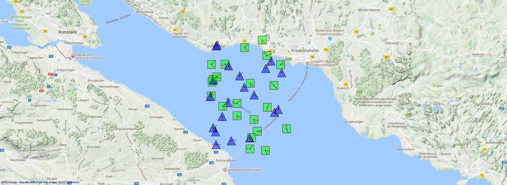

# Scenario TestScenario

## About This Scenario

|Property|Value|
|--------|-----|
|Version|1.0|
|Application Context|Scenario Meta Information Test|
|Contact Person|Jörg Lanser|
|User Description|[ScenarioDescription.md](./ScenarioDescription.md)|

---

## RFDevice List

|  Id|DeviceSource|StartTime|Name|Latitude|Longitude|Altitude|Roll|Pitch|Yaw|RxTxType|AntennaType|CenterFrequency|Bandwidth|Gain|SignalToNoiseRatio|
|---:|:-----------|:-------:|:---|-------:|--------:|-------:|---:|----:|--:|:-------|:----------|--------------:|--------:|---:|-----------------:|
|-979|Automatic|15,07|RFDevice #15|47,5948|9,4110|1,328 km|-61|-64|111|HackRF|OmniLOG30800|9,30 MHz|16,00 KHz|12,04 dB|55,42 dB|
|-978|Automatic|16,06|RFDevice #16|47,6689|9,4309|3,059 km|68|11|-10|Iridium|HyperLOG60200|9,10 MHz|17,00 KHz|83,03 dB|137,04 dB|
|-934|Automatic|12,08|RFDevice #12|47,5765|9,4058|3,587 km|88|50|70|LTE|OmniDirectional|10,10 MHz|16,00 KHz|77,77 dB|38,70 dB|
|-919|Automatic|29,03|RFDevice #29|47,6041|9,3798|6,866 km|-39|1|137|NFMRadio|Unknown|9,80 MHz|12,00 KHz|114,98 dB|88,81 dB|
|-888|Automatic|26,04|RFDevice #26|47,6010|9,3653|993 m|-50|-58|16|NFMRadio|SimradArgusRadar|9,50 MHz|19,00 KHz|69,71 dB|27,14 dB|
|-823|Automatic|11,09|RFDevice #11|47,6257|9,3652|3,478 km|81|-75|31|GPSJammer|Unknown|8,50 MHz|18,00 KHz|51,10 dB|22,27 dB|
|-743|Automatic|13,08|RFDevice #13|47,6202|9,4433|9,769 km|21|-55|136|Unknown|OmniLOG30800|9,00 MHz|11,00 KHz|36,90 dB|58,61 dB|
|-709|Automatic|9,11|RFDevice #9|47,6406|9,4310|8,74 km|-13|-16|-92|IdealSDR|OmniLOG30800|9,70 MHz|13,00 KHz|83,01 dB|28,61 dB|
|-689|Automatic|3,33|RFDevice #3|47,6237|9,3680|558 m|-47|-51|-32|LTE|OmniLOG30800|10,40 MHz|17,00 KHz|45,19 dB|31,39 dB|
|-640|Automatic|31,03|RFDevice #31|47,5857|9,4050|9,648 km|57|-8|-133|IdealSDR|SimradArgusRadar|9,30 MHz|19,00 KHz|82,54 dB|102,22 dB|
|-525|Automatic|28,04|RFDevice #28|47,6333|9,4187|1,868 km|-22|-4|-62|IdealSDR|OmniLOG30800|9,80 MHz|19,00 KHz|4,81 dB|139,76 dB|
|-314|Automatic|27,04|RFDevice #27|47,6222|9,3982|2,985 km|-90|15|-130|Unknown|HyperLOG60200|9,70 MHz|17,00 KHz|21,65 dB|117,20 dB|
|-262|Automatic|5,2|RFDevice #5|47,6378|9,4158|3,84 km|-87|21|59|Iridium|OmniDirectional|10,20 MHz|12,00 KHz|16,35 dB|108,64 dB|
|-247|Automatic|23,04|RFDevice #23|47,5805|9,4027|9,031 km|82|29|33|LTE|Unknown|10,40 MHz|15,00 KHz|20,67 dB|46,71 dB|
|-71|Automatic|19,05|RFDevice #19|47,6679|9,4303|7,232 km|-49|27|-135|SIN|HyperLOG60200|9,00 MHz|16,00 KHz|139,57 dB|12,76 dB|
|-35|Automatic|40,02|RFDevice #40|47,6212|9,4447|6,925 km|35|51|-100|GPSJammer|OmniDirectional|9,40 MHz|10,00 KHz|113,92 dB|68,97 dB|
|-32|Automatic|10,1|RFDevice #10|47,6043|9,3664|3,086 km|-50|63|64|SIN|OmniLOG30800|9,30 MHz|13,00 KHz|23,89 dB|69,55 dB|
|-21|Automatic|38,03|RFDevice #38|47,6470|9,3615|6,777 km|-86|72|-159|QPSK|OmniDirectional|8,90 MHz|12,00 KHz|75,94 dB|1,62 dB|
|0|Automatic|32,03|RFDevice #32|47,6175|9,4016|4,874 km|-58|62|86|B200mini|Unknown|9,50 MHz|13,00 KHz|5,01 dB|44,18 dB|
|77|Automatic|24,04|RFDevice #24|47,6682|9,4473|6,247 km|46|-78|26|B200mini|OmniLOG30800|8,90 MHz|16,00 KHz|38,55 dB|71,41 dB|
|159|Automatic|33,03|RFDevice #33|47,6213|9,4148|9,699 km|-32|-65|118|AIS|HyperLOG60200|9,90 MHz|19,00 KHz|98,92 dB|118,01 dB|
|170|Automatic|41,02|RFDevice #41|47,6024|9,4049|3,248 km|11|-28|115|Iridium|HyperLOG60200|8,80 MHz|17,00 KHz|16,42 dB|40,66 dB|
|215|Automatic|14,07|RFDevice #14|47,6573|9,3771|1,891 km|-18|54|148|IdealSDR|Unknown|10,00 MHz|16,00 KHz|57,96 dB|98,08 dB|
|229|Automatic|35,03|RFDevice #35|47,6401|9,4279|444 m|-77|-70|150|SIN|SimradArgusRadar|9,90 MHz|13,00 KHz|32,65 dB|71,93 dB|
|235|Automatic|17,06|RFDevice #17|47,6232|9,3697|2,393 km|-89|34|159|GPSJammer|OmniDirectional|9,40 MHz|17,00 KHz|72,17 dB|138,73 dB|
|307|Automatic|8,12|RFDevice #8|47,6082|9,3951|6,662 km|-45|15|-84|Unknown|Unknown|10,30 MHz|15,00 KHz|83,49 dB|96,01 dB|
|336|Automatic|2|RFDevice #1|47,6319|9,3843|9,171 km|-68|17|56|AIS|HyperLOG60200|10,40 MHz|18,00 KHz|58,85 dB|58,46 dB|
|365|Automatic|25,04|RFDevice #25|47,6186|9,4021|1,19 km|-19|44|-16|Unknown|OmniDirectional|9,50 MHz|19,00 KHz|23,19 dB|103,98 dB|
|388|Automatic|34,03|RFDevice #34|47,5981|9,4547|5,353 km|-55|28|2|FMBroadcast|OmniDirectional|9,40 MHz|16,00 KHz|126,07 dB|132,13 dB|
|435|Automatic|39,03|RFDevice #39|47,6726|9,4302|4,033 km|-87|-22|31|QPSK|OmniDirectional|8,50 MHz|17,00 KHz|59,96 dB|84,04 dB|
|438|Automatic|37,03|RFDevice #37|47,6577|9,4286|6,76 km|-81|28|99|NFMRadio|HyperLOG60200|10,10 MHz|18,00 KHz|123,04 dB|3,89 dB|
|587|Automatic|42,02|RFDevice #42|47,5967|9,4517|10,859 km|65|51|128|LTE|HyperLOG60200|9,80 MHz|12,00 KHz|52,34 dB|96,62 dB|
|606|Automatic|18,06|RFDevice #18|47,6324|9,3606|9,95 km|-49|23|-122|LTE|OmniLOG30800|9,80 MHz|11,00 KHz|12,48 dB|120,97 dB|
|613|Automatic|30,03|RFDevice #30|47,6230|9,4451|12,166 km|48|30|171|HackRF|Unknown|10,40 MHz|15,00 KHz|17,85 dB|23,57 dB|
|660|Automatic|7,14|RFDevice #7|47,6197|9,3915|8,11 km|-79|9|-158|AIS|Unknown|9,30 MHz|10,00 KHz|80,88 dB|11,17 dB|
|709|Automatic|22,05|RFDevice #22|47,6365|9,3867|10,983 km|-15|-87|-160|SIN|HyperLOG60200|10,20 MHz|19,00 KHz|45,57 dB|116,16 dB|
|724|Automatic|21,05|RFDevice #21|47,6304|9,3605|7,798 km|41|-62|-99|IdealSDR|Unknown|8,80 MHz|10,00 KHz|82,32 dB|120,78 dB|
|803|Automatic|20,05|RFDevice #20|47,6160|9,3713|8,67 km|39|-62|113|IdealSDR|OmniDirectional|8,70 MHz|19,00 KHz|32,04 dB|135,35 dB|
|825|Automatic|2,5|RFDevice #2|47,6367|9,3835|2,985 km|3|69|-30|LTE|Unknown|10,00 MHz|12,00 KHz|63,29 dB|97,33 dB|
|846|Automatic|6,17|RFDevice #6|47,6380|9,4353|883 m|-14|-51|16|TwinRx|Unknown|9,30 MHz|11,00 KHz|17,85 dB|100,17 dB|
|872|Automatic|36,03|RFDevice #36|47,6419|9,4386|9,153 km|-89|81|5|Unknown|HyperLOG60200|10,20 MHz|14,00 KHz|2,62 dB|84,17 dB|
|935|Automatic|4,25|RFDevice #4|47,6019|9,4001|2,702 km|62|-86|-60|TwinRx|SimradArgusRadar|10,40 MHz|11,00 KHz|42,46 dB|132,99 dB|
---

## Validation Results

|Timestamp|Servity|Message|Source|PropertyName|Value|
|:---:|:---|:---|:---|:---|:---|
|11.05.2019 20:52:37|Warning|The AntennaType Is Unknown!|RFDevice #2 (825)|AntennaType|Unknown|
|11.05.2019 20:52:37|Warning|The RxTxType Is Not Valid For This Device!|RFDevice #3 (-689)|RxTxType|LTE|
|11.05.2019 20:52:37|Warning|The RxTxType Is Not Valid For This Device!|RFDevice #4 (935)|RxTxType|TwinRx|
|11.05.2019 20:52:37|Warning|The RxTxType Is Not Valid For This Device!|RFDevice #5 (-262)|RxTxType|Iridium|
|11.05.2019 20:52:37|Warning|The RxTxType Is Not Valid For This Device!|RFDevice #6 (846)|RxTxType|TwinRx|
|11.05.2019 20:52:37|Warning|The AntennaType Is Unknown!|RFDevice #6 (846)|AntennaType|Unknown|
|11.05.2019 20:52:37|Warning|The AntennaType Is Unknown!|RFDevice #7 (660)|AntennaType|Unknown|
|11.05.2019 20:52:37|Warning|The RxTxType Is Unknown!|RFDevice #8 (307)|RxTxType|Unknown|
|11.05.2019 20:52:37|Warning|The RxTxType Is Not Valid For This Device!|RFDevice #8 (307)|RxTxType|Unknown|
|11.05.2019 20:52:37|Warning|The AntennaType Is Unknown!|RFDevice #8 (307)|AntennaType|Unknown|
|11.05.2019 20:52:37|Warning|The RxTxType Is Not Valid For This Device!|RFDevice #10 (-32)|RxTxType|SIN|
|11.05.2019 20:52:37|Warning|The RxTxType Is Not Valid For This Device!|RFDevice #11 (-823)|RxTxType|GPSJammer|
|11.05.2019 20:52:37|Warning|The AntennaType Is Unknown!|RFDevice #11 (-823)|AntennaType|Unknown|
|11.05.2019 20:52:37|Warning|The RxTxType Is Not Valid For This Device!|RFDevice #12 (-934)|RxTxType|LTE|
|11.05.2019 20:52:37|Warning|The RxTxType Is Unknown!|RFDevice #13 (-743)|RxTxType|Unknown|
|11.05.2019 20:52:37|Warning|The RxTxType Is Not Valid For This Device!|RFDevice #13 (-743)|RxTxType|Unknown|
|11.05.2019 20:52:37|Warning|The RxTxType Is Not Valid For This Device!|RFDevice #14 (215)|RxTxType|IdealSDR|
|11.05.2019 20:52:37|Warning|The AntennaType Is Unknown!|RFDevice #14 (215)|AntennaType|Unknown|
|11.05.2019 20:52:37|Warning|The RxTxType Is Not Valid For This Device!|RFDevice #16 (-978)|RxTxType|Iridium|
|11.05.2019 20:52:37|Warning|The RxTxType Is Not Valid For This Device!|RFDevice #19 (-71)|RxTxType|SIN|
|11.05.2019 20:52:37|Warning|The RxTxType Is Not Valid For This Device!|RFDevice #20 (803)|RxTxType|IdealSDR|
|11.05.2019 20:52:37|Warning|The RxTxType Is Not Valid For This Device!|RFDevice #21 (724)|RxTxType|IdealSDR|
|11.05.2019 20:52:37|Warning|The AntennaType Is Unknown!|RFDevice #21 (724)|AntennaType|Unknown|
|11.05.2019 20:52:37|Warning|The RxTxType Is Not Valid For This Device!|RFDevice #23 (-247)|RxTxType|LTE|
|11.05.2019 20:52:37|Warning|The AntennaType Is Unknown!|RFDevice #23 (-247)|AntennaType|Unknown|
|11.05.2019 20:52:37|Warning|The RxTxType Is Not Valid For This Device!|RFDevice #24 (77)|RxTxType|B200mini|
|11.05.2019 20:52:37|Warning|The RxTxType Is Unknown!|RFDevice #25 (365)|RxTxType|Unknown|
|11.05.2019 20:52:37|Warning|The RxTxType Is Not Valid For This Device!|RFDevice #25 (365)|RxTxType|Unknown|
|11.05.2019 20:52:37|Warning|The RxTxType Is Not Valid For This Device!|RFDevice #26 (-888)|RxTxType|NFMRadio|
|11.05.2019 20:52:37|Warning|The RxTxType Is Unknown!|RFDevice #27 (-314)|RxTxType|Unknown|
|11.05.2019 20:52:37|Warning|The RxTxType Is Not Valid For This Device!|RFDevice #27 (-314)|RxTxType|Unknown|
|11.05.2019 20:52:37|Warning|The RxTxType Is Not Valid For This Device!|RFDevice #29 (-919)|RxTxType|NFMRadio|
|11.05.2019 20:52:37|Warning|The AntennaType Is Unknown!|RFDevice #29 (-919)|AntennaType|Unknown|
|11.05.2019 20:52:37|Warning|The RxTxType Is Not Valid For This Device!|RFDevice #30 (613)|RxTxType|HackRF|
|11.05.2019 20:52:37|Warning|The AntennaType Is Unknown!|RFDevice #30 (613)|AntennaType|Unknown|
|11.05.2019 20:52:37|Warning|The RxTxType Is Not Valid For This Device!|RFDevice #32 (0)|RxTxType|B200mini|
|11.05.2019 20:52:37|Warning|The AntennaType Is Unknown!|RFDevice #32 (0)|AntennaType|Unknown|
|11.05.2019 20:52:37|Warning|The RxTxType Is Unknown!|RFDevice #36 (872)|RxTxType|Unknown|
|11.05.2019 20:52:37|Warning|The RxTxType Is Not Valid For This Device!|RFDevice #36 (872)|RxTxType|Unknown|
|11.05.2019 20:52:37|Warning|The RxTxType Is Not Valid For This Device!|RFDevice #38 (-21)|RxTxType|QPSK|
|11.05.2019 20:52:37|Warning|The RxTxType Is Not Valid For This Device!|RFDevice #40 (-35)|RxTxType|GPSJammer|

---

## Screenshot

