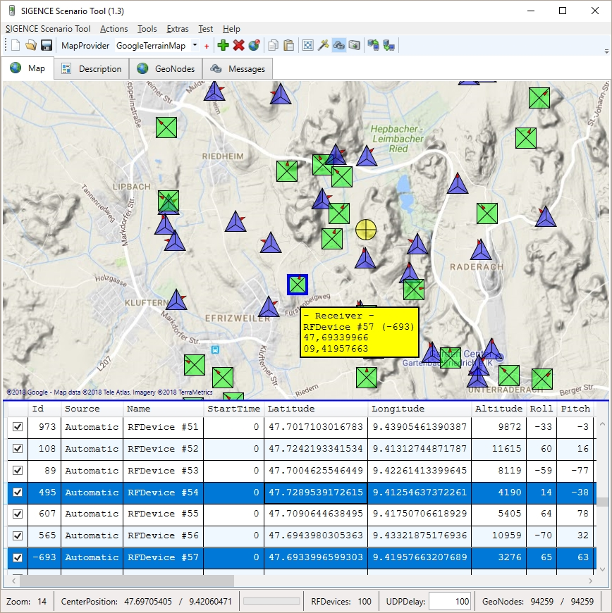

# SIGENCE Scenario Tool

A **little** tool to place RF Devices on a map, edit, save and load them, or export the devicelist to a file (.csv,.json,.xml,.xlsx). Look into the [Wiki](https://github.com/ObiWanLansi/SIGENCE-Scenario-Tool/wiki) for more information and usage.

## Documentation

- [Cheat Sheet](Documentation/Generated/CheatSheet.pdf)
- [Enumerations](Source/SIGENCEScenarioTool.MainApp/Src/Models/EnumerationsAndConstants.md)
- [RF Device Model](Source/SIGENCEScenarioTool.MainApp/Src/Models/RFDevice/RFDevice.Properties.md)

## Quick Links

- [Issues](https://github.com/ObiWanLansi/SIGENCE-Scenario-Tool/issues/)
- [Kanban Board](https://github.com/ObiWanLansi/SIGENCE-Scenario-Tool/projects/1/)
- [Wiki](https://github.com/ObiWanLansi/SIGENCE-Scenario-Tool/wiki/)

## Screenshot

## Dependencies &amp; Third Party Libraries

- [GMap.NET.Presentation](https://www.nuget.org/packages/GMap.NET.Presentation/)
- [Newtonsoft.Json](https://www.nuget.org/packages/Newtonsoft.Json/)
- [NUnit](https://www.nuget.org/packages/NUnit/)
- [Log4Net](https://www.nuget.org/packages/log4net/)
- [Blink1](https://www.nuget.org/packages/Blink1.ObiWanLansi/)
- [NetTopologySuite](https://www.nuget.org/packages/NetTopologySuite/)
- [iTextSharp](https://www.nuget.org/packages/iTextSharp/)
- [QRCoder](https://github.com/codebude/QRCoder/)
- [System.Data.SQLite](https://www.nuget.org/packages/System.Data.SQLite/)
- [ICSharpCode.TextEditor](https://www.nuget.org/packages/ICSharpCode.TextEditor/)

## License

The tool is current licensed under [GNU Lesser General Public License v3.0.](https://github.com/ObiWanLansi/SIGENCE-Scenario-Tool/blob/master/LICENSE)
